<div align="center">

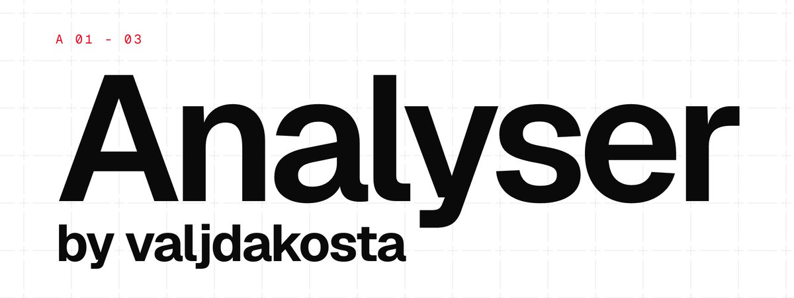

# Analyser

**A zero-backend forensic workbench for files, running entirely in your browser.**

Drop in any file and it is classified, parsed and visualised on your device. Nothing is uploaded, ever.

[**Open Analyser**](https://lab.valjdakosta.com) · [Supported formats](https://lab.valjdakosta.com/formats) · [Samples](https://lab.valjdakosta.com/samples) · [About](https://lab.valjdakosta.com/about) · [Changelog](https://lab.valjdakosta.com/patch)

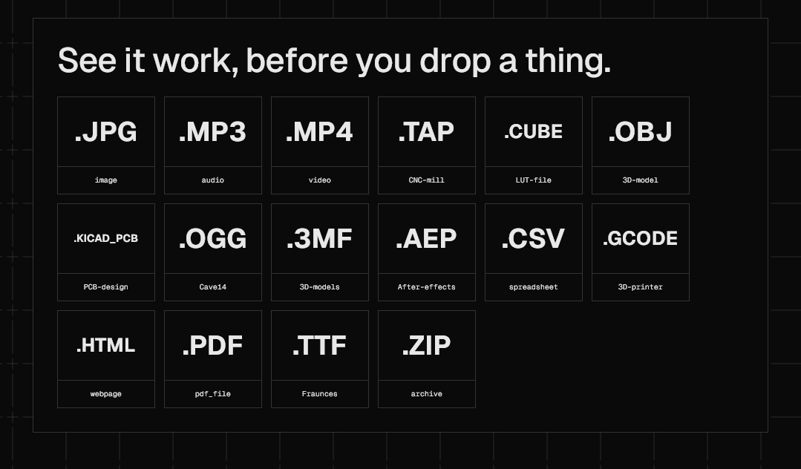

</div>

---

## Why

Most "file inspector" sites work by uploading your file to a server, which is exactly what you do not want for private photos, contracts, disk images or key files. Analyser takes the opposite approach: the page is static, there is no backend at all, and every byte of analysis happens in your browser through the File API and lazy-loaded WebAssembly. It works offline as an installable PWA, and you can verify the no-upload claim with the network tab open.

## What it can open

Analyser recognises **over 1,350 file types**. The depth varies by format: photos, audio, video, documents, 3D models, archives, maps and databases get full viewers and deep analysis, while hundreds of proprietary formats are identified by magic bytes with their header metadata decoded. Anything still unknown gets a hex dump and best-effort identification.

The full, searchable list is at [lab.valjdakosta.com/formats](https://lab.valjdakosta.com/formats), with a guide page for every supported extension. There is also a [compare page](https://lab.valjdakosta.com/compare) that runs two files through the same analysis side by side and highlights every field where they differ, and a [samples gallery](https://lab.valjdakosta.com/samples) of example files to try without needing your own.

## Beyond identification

Identifying a file is just the entry point. The real work starts once Analyser knows what it is holding, and a lot of that is best shown rather than described.

### Audio: spectrograms, isolation and on-device AI

Waveform and spectrogram views (down into the sub-20 Hz range), codec and loudness analysis, reversed playback, and live microphone capture. The frequency-isolation panel lets you carve out bands in real time, and an in-browser AI model separates vocals from instrumentals with no server round-trip.

<div align="center">
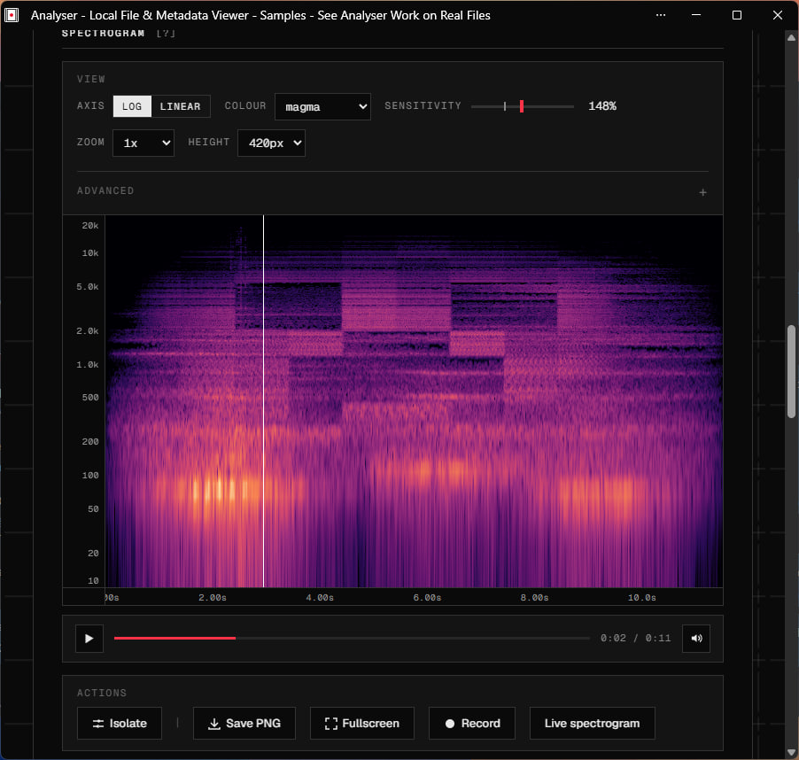
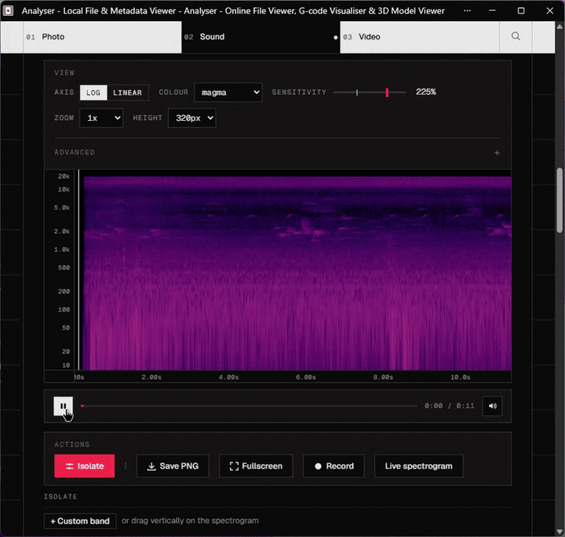
</div>

<div align="center">


https://github.com/user-attachments/assets/a9226e4a-90d0-45d2-8c82-d65578e2b3e8


<em>On-device AI vocal separation: the model runs entirely in the browser, nothing is uploaded.</em>

</div>

### 3D, CAD and manufacturing

STL and STEP/IGES viewers, DWG drawings, SolidWorks and Fusion 360 packages, and a G-code toolpath simulator that rebuilds the print as solid deposited filament, animates the build layer by layer, and can export a shareable video clip of it.

<div align="center">
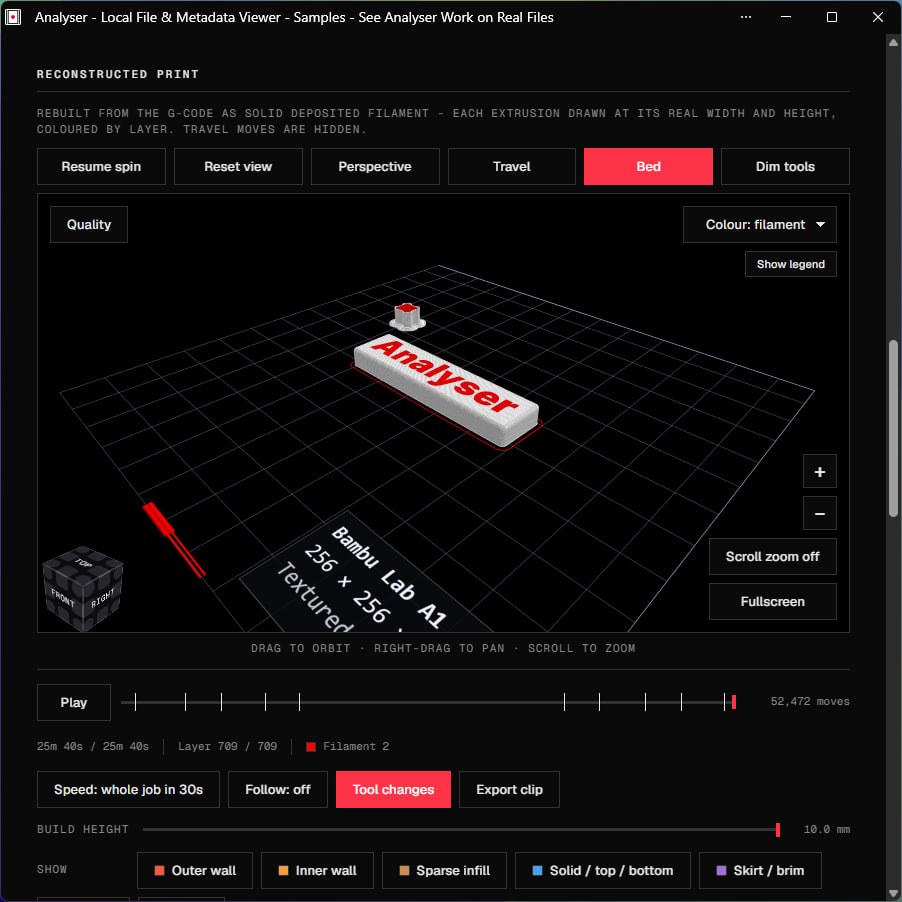
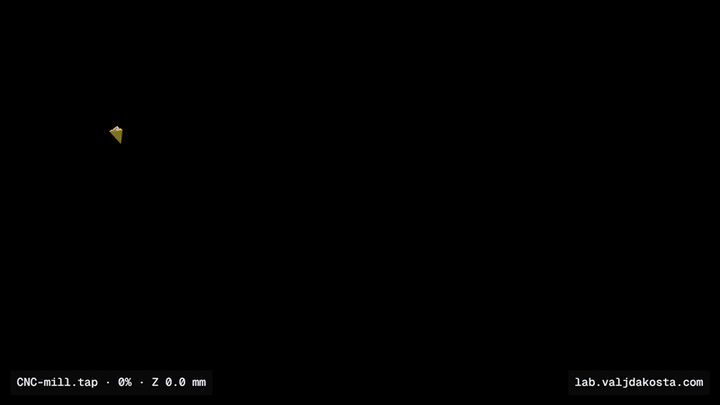
</div>

### Electronics

KiCad and Altium PCB projects render as an interactive 3D board you can flip and inspect, alongside schematics, SPICE waveforms and IPC netlists.

<div align="center">
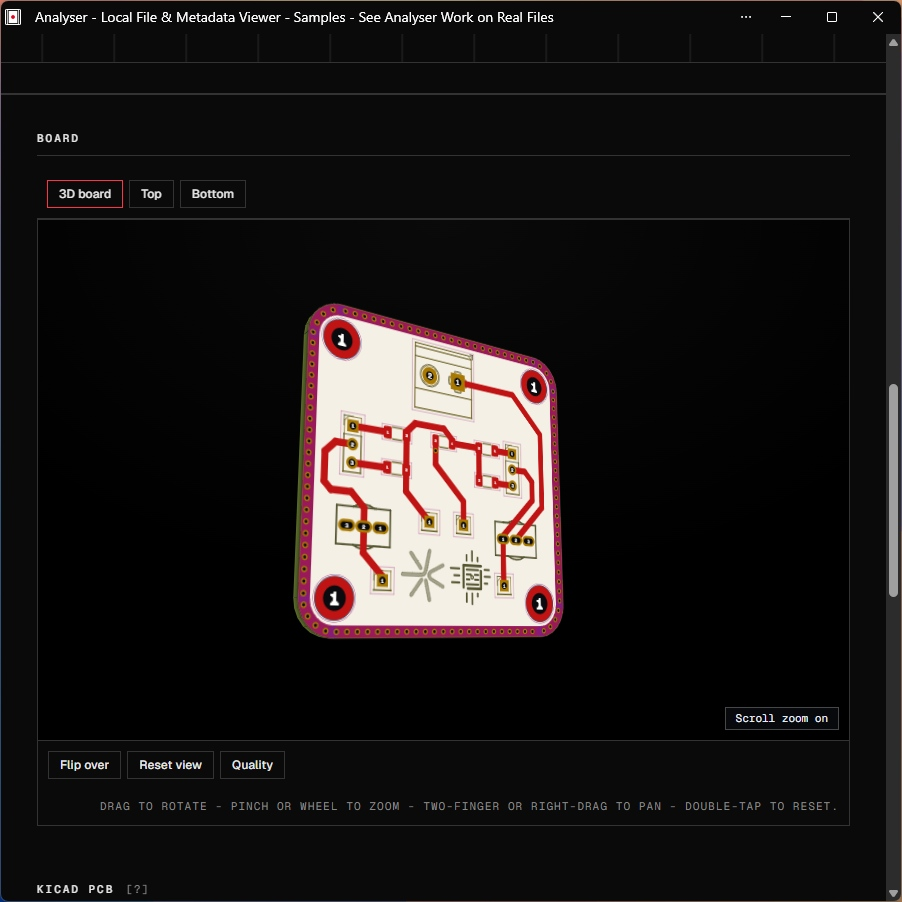
</div>

### Creative project files

After Effects, Premiere, DaVinci Resolve and VEGAS projects with previewable composition timelines, EDL/FCPXML/OTIO timelines, PSD and Illustrator files, colour LUTs, animated font specimens, Lottie animations, MIDI scores, subtitles and lyrics.

<div align="center">

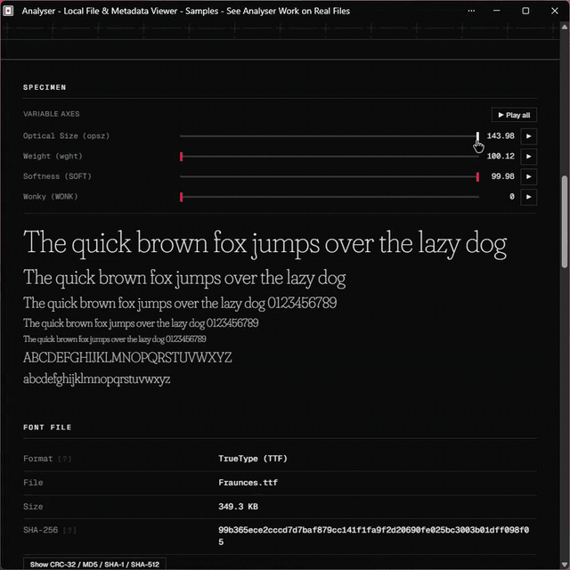
</div>

### Folders and archives

Browse ZIP, 7z, RAR and whole dropped folders, with a treemap that breaks down where the size actually goes and lets you click straight into any file to analyse it. Comics (CBZ/CBR), e-books (EPUB/MOBI), DjVu scans and Jupyter notebooks get proper readers.

<div align="center">
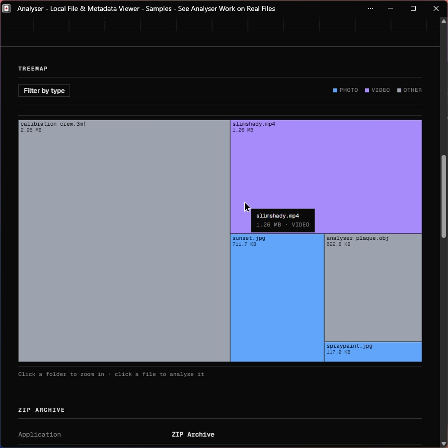
</div>

### And more

- **File recovery** - repair truncated or corrupt JPEG/PNG files, rebuild a damaged JPEG header using a reference photo from the same camera, carve embedded images out of any blob, and salvage unfinalised MP4/MOV recordings with no index by extracting the raw H.264/H.265 stream (with a reference clip as donor if needed).
- **Photos** - EXIF and GPS readout, histograms, OCR, QR-code detection, HEIC and camera-RAW conversion, and a "sonify" mode that turns the image into sound.
- **Video** - per-frame and stream analysis, scene-change detection, and scrubbing synced between the player and the readouts.
- **Forensics and data** - CRC-32, MD5, SHA-1, SHA-256 and SHA-512 hashes, a network-indicator (OSINT) card that pulls URLs, IPs, domains and emails out of any file into click-to-open lookup links (nothing is contacted automatically), plus viewers for SQLite databases, git objects, emails and disk images, and a JSON export of the full analysis.
- **Geodata** - GPX tracks, KML and GeoJSON plotted on a map, rendered locally.

## Privacy

- No uploads: files are read with the File API and never leave the device.
- No accounts, no tracking, no analytics, ZERO tracking cookies.
- Works fully offline once installed; the service worker precaches the app shell and keeps the WASM engines after first use.
- Private keys and secrets found inside files are flagged, not transmitted.

The only network call the site ever makes on its own is a single anonymous "file analysed" ping carrying nothing but a lowercase extension string. Those counts feed the public [live-usage page](https://lab.valjdakosta.com/stats), an honest tally of what people drop, with unrecognised types pooled into one row so their names are never shown or stored.

<div align="center">
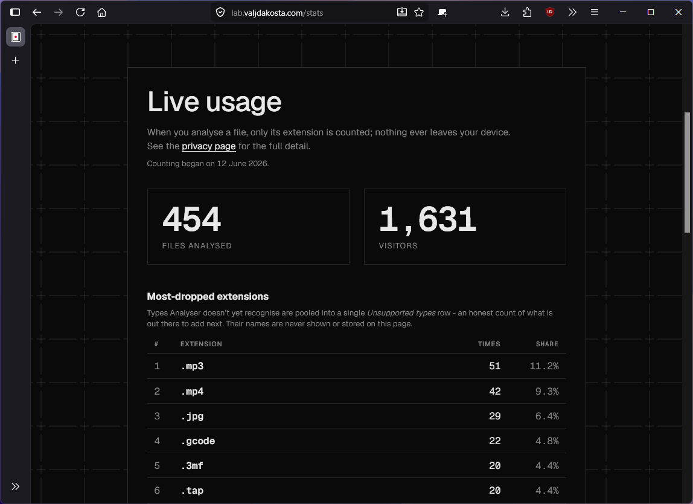
</div>

## Style

You have probably never seen a file analysis website this stylish. It follows a [swiss design](https://en.wikipedia.org/wiki/Swiss_Style_(design)) inspired layout, colour palette and set of fonts which I am very happy with. I made sure to sacrifice no functionality or readability for the sake of being cool, and hopefully succeeded in that too. Sharp corners, mono type, no clutter. And a... hidden game?

<div align="center">
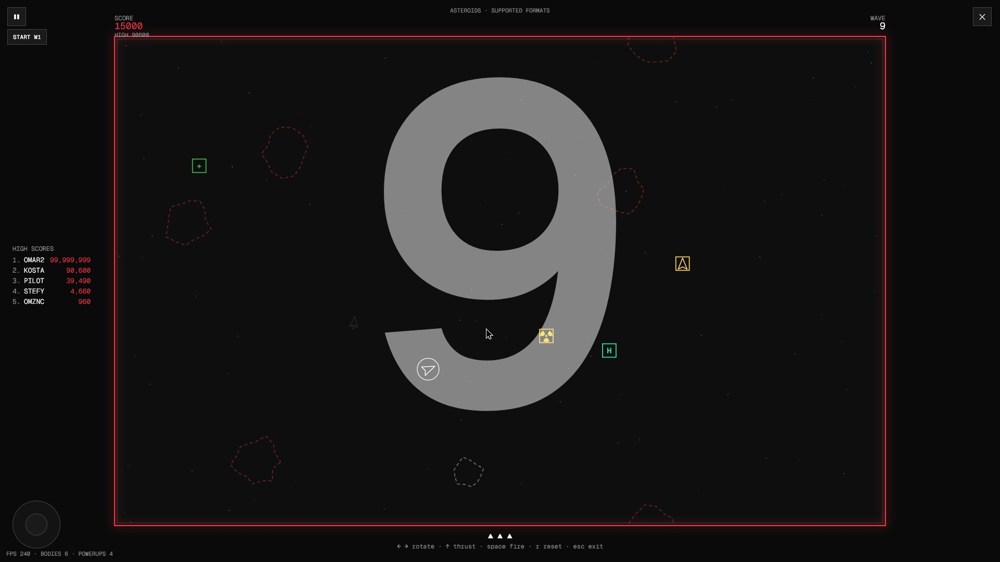
</div>

## Under the hood

The site is plain HTML, CSS and ES-module JavaScript. No framework, no build step, no `node_modules`. Heavy lifting is done by WebAssembly engines and specialist libraries, loaded lazily only when a file actually needs them:

- **FFmpeg** for video remuxing, frame extraction and audio decoding
- **ImageMagick** for RAW photo conversion
- **pdf.js** and **Ghostscript** for PDF and PostScript
- **Tesseract** for OCR
- **OpenCASCADE** for STEP/IGES tessellation (fetched on first use, then cached for offline)
- **sql.js** for SQLite, **libarchive** and **xz** for archives, **OpenJPEG** for JPEG 2000
- **exifr**, **heic2any**, **jsQR**, **Leaflet**, **fflate** and friends

Most parsing, though, is hand-written: a couple of hundred binary header parsers organised into lazy per-domain chunks, so the initial page stays small. Deployment is just static assets on Cloudflare; every push to `main` ships.

## Offline install

The "Download for offline use" section in the footer caches Analyser as an installable, fully offline Progressive Web App, in three cumulative tiers: **Essentials** (the whole app), **Everything** (adds OCR, maps, QR scanning, HEIC, archives, PostScript, CAD drawings and the samples gallery) and **Complete** (OCR in 30+ languages plus the on-device AI vocal separation).

<div align="center">
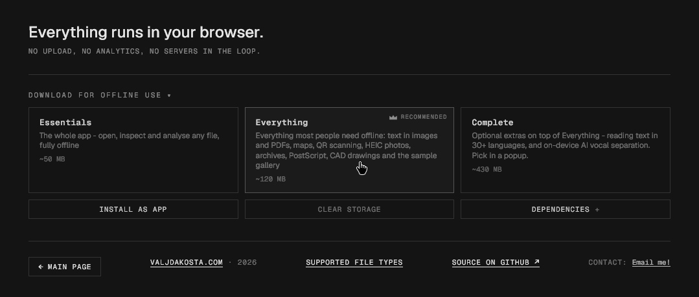
</div>

## Running locally

```
server.bat
```

This starts a local instance on localhost:3000 and opens it in a browser. It keeps 100% of the functionality since everything was built to be server-independent. The printed network URL also works for phone testing on the same Wi-Fi. There is nothing to install and nothing to build; editing a file and refreshing is the whole dev loop.

## Project layout

- `web/` - the entire website (served at the domain root); everything below lives here
- `web/index.html` - the drop-and-analyse app
- `web/assets/js/core/formats.js` - the single source of truth for every supported file type
- `web/assets/js/renderers/` - one module per top-level type (photo, audio, video, PDF, 3D, ...)
- `web/assets/js/parsers/` - lazy per-domain metadata parsers for the long tail of formats
- `web/assets/js/lib/` - shared binary helpers and WASM loaders
- `web/assets/vendor/` - third-party libraries, served locally so the app stays offline-capable
- `tools/` - Node scripts (in the repo root) that pre-render the `/formats` SEO pages from the catalog
- `worker/` - the Cloudflare Worker behind the anonymous analysed-file counter (the only server-side code)
- `web/sw.js` - the service worker behind the offline support

## Versioning

Every commit is its own version (currently in the 5.x era), stamped automatically at commit time. The full history, one entry per commit, is on the [changelog](https://lab.valjdakosta.com/patch).

## Credits

The idea and need for this website was mine, originally made as a simple tool for generating spectrograms and reading a photo aspect ratio, that spiraled out of control pretty quickly. Many thanks to my parents, who encouraged me to continue by finding this cool, and to friends who tested this for me on platforms I do not possess or use frequently (Linux Arch and Debian, macOS). Since this project was made possible with Claude, and having in mind the moral and ethical dilemmas regarding AI usage, I decided to make the source available to the public.

## License

Copyright © 2026 Kosta. Licensed under the [GNU General Public License v3.0](LICENSE).

Analyser is free software: you are free to use, study, modify and share it, for any purpose including commercially. The condition is reciprocity, if you distribute it or a modified version, you must pass on the same freedoms, releasing your source under the GPL too. It comes with no warranty.

This licence covers the code I wrote. Third-party libraries under `web/assets/vendor/` remain under their own licences (Ghostscript under AGPL-3.0 and LibRaw under LGPL among them), each shipped with its licence alongside it and credited in the site footer.

## Documentation

For a deeper look at the codebase, architecture, the drop-to-render pipeline, every renderer module, and a full usage reference for every feature on the site, see [`lab.valjdakosta.com/docs`](documentation).
